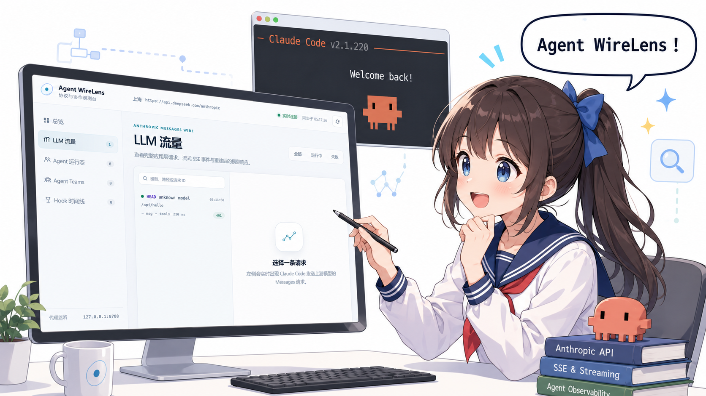
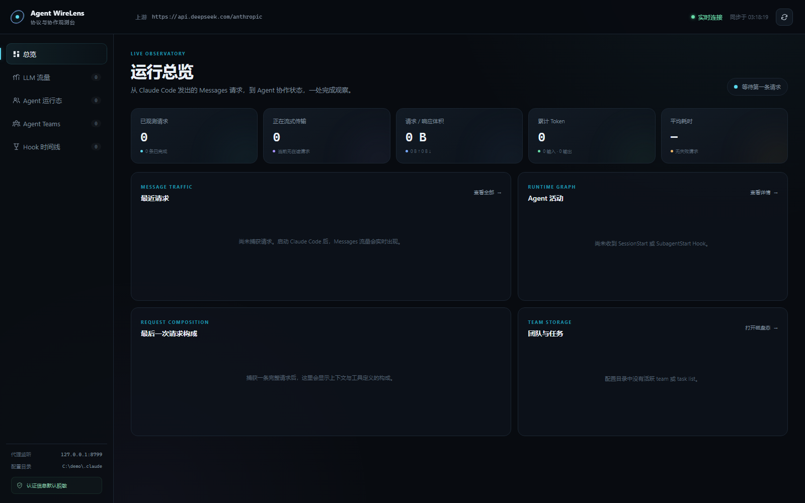

<p align="center">
  
</p>

<h2 align="center"> Agent WireLens</h2>

<p align="center">
  <a href="https://github.com/Palind-Rome/agent-wirelens/actions/workflows/test.yml"></a>
  <a href="https://nodejs.org/"></a>
  <a href="./LICENSE"></a>
  <a href="https://github.com/Palind-Rome/agent-wirelens"></a>
</p>

<p align="center">
  反向网关实验台，为了看清楚 Claude Code 发的啥请求与相应。面向 <strong>Anthropic Messages、SSE、subagent 与 Agent Team</strong>。
</p>

---

Agent WireLens 是一个显式的本地反向网关。它把 Claude Code 的三个观察面放在同一个界面：

1. Claude Code 发出的完整 Anthropic Messages 请求，包括 `system`、`messages`、工具 schema、推理配置和请求头。
2. 上游返回给 Claude Code 的状态码、响应头、原始 SSE 字节流、事件时间线与重建后的 assistant message。
3. Claude Code hooks 与本地 team/task/mailbox 文件暴露的 session、subagent 和 teammate 状态。



## 主要能力

- **透明的应用层捕获**：request body 以原始字节转发，不经过解析后重组。
- **SSE 双视图**：保留上游原始流，同时解析事件并重建最终 assistant message。
- **工具循环分析**：对照连续请求中的 `tool_use` 与 `tool_result`。
- **Agent 生命周期**：归并 `SubagentStart`、`SubagentStop`、task 与 teammate hooks。
- **Agent Team 磁盘态**：只读展示 roster、mailbox、任务状态与依赖。
- **隐私优先**：默认仅监听 loopback、认证头脱敏、捕获仅保存在内存。
- **零运行时依赖**：只使用 Node.js 标准库。
- **主题切换**：右上角可在跟随系统、亮色和深色之间切换，选择保存在浏览器本地。

## 工作方式

```text
Claude Code
    │ HTTP，loopback
    │ ANTHROPIC_BASE_URL=http://127.0.0.1:8788
    ▼
Agent WireLens
    │ HTTPS
    │ upstream=https://api.deepseek.com/anthropic
    ▼
DeepSeek Anthropic-compatible API
```

WireLens 不是传统的 `HTTPS_PROXY`，也不安装代理 CA、不终止客户端 TLS、不关闭证书校验。它利用 Claude Code 支持的 `ANTHROPIC_BASE_URL`，让 Claude Code 主动把应用层请求交给本机网关。

这里的“原始”有明确边界：

- **request raw**：Claude Code 交给 WireLens 的请求体字节。
- **server-facing**：WireLens 实际发往上游的 URL、应用层 headers 和同一份 body。`Host` 与 hop-by-hop headers 会按照 HTTP 规则处理。
- **response raw**：上游返回、WireLens 逐块写回 Claude Code 的响应体字节。语义视图使用旁路副本解析，不改变下载的 raw 数据。

WireLens 不展示 TLS record，也无法观察上游负载均衡器之后的内部改写。

## 环境要求

- Node.js 20 或更新版本。
- Claude Code 使用 Anthropic Messages API provider。
- 上游实现 Anthropic-compatible Messages API。

Bedrock、Vertex 和 Foundry 的专用协议当前不在代理范围内。

## 快速开始

### 1. 启动 WireLens

```powershell
git clone https://github.com/Palind-Rome/agent-wirelens.git
cd agent-wirelens
node .\bin\wirelens.mjs `
  --upstream https://api.deepseek.com/anthropic
```

打开仪表盘：

```text
http://127.0.0.1:8788/_wirelens/
```

默认情况下，请求只保存在内存中。需要将脱敏后的记录追加写入 NDJSON 时，显式增加：

```powershell
--capture-dir .\.wirelens-captures
```

### 2. 让 Claude Code 经过 WireLens

以下示例使用 DeepSeek Anthropic-compatible API：

```powershell
$env:ANTHROPIC_BASE_URL = "http://127.0.0.1:8788"
$env:ANTHROPIC_AUTH_TOKEN = "<你的 DeepSeek API Key>"
$env:NO_PROXY = "127.0.0.1,localhost"

$env:ANTHROPIC_MODEL = "deepseek-v4-pro[1m]"
$env:ANTHROPIC_DEFAULT_OPUS_MODEL = "deepseek-v4-pro[1m]"
$env:ANTHROPIC_DEFAULT_SONNET_MODEL = "deepseek-v4-pro[1m]"
$env:ANTHROPIC_DEFAULT_HAIKU_MODEL = "deepseek-v4-flash"
$env:CLAUDE_CODE_SUBAGENT_MODEL = "deepseek-v4-flash"
$env:CLAUDE_CODE_EFFORT_LEVEL = "max"

claude
```

WireLens 会把客户端请求路径拼到上游 base path 后面：

```text
客户端：  http://127.0.0.1:8788/v1/messages?beta=true
上游：    https://api.deepseek.com/anthropic/v1/messages?beta=true
```

不要把 `--upstream` 指回 WireLens 自己，否则会形成代理环。程序会拒绝常见的本机环路配置。

DeepSeek 相关配置应以其官方文档为准：

- [Claude Code 接入](https://api-docs.deepseek.com/zh-cn/quick_start/agent_integrations/claude_code/)
- [Anthropic API 兼容性](https://api-docs.deepseek.com/guides/anthropic_api)

## 使用 CC Switch 固化实验配置

如果日常通过 CC Switch 管理 Claude Code provider，可以把 WireLens 建成固定供应商。这样不必在每次实验前重新设置 API Key、Base URL 和模型变量。

以下界面名称以 CC Switch 3.16.5 为准。配置后的链路仍应是：

```text
Claude Code → Agent WireLens :8788 → DeepSeek Anthropic API
```

### 重要：不要开启 CC Switch 本地代理接管

CC Switch 在这里仅负责把 provider 配置写给 Claude Code。不要开启 CC Switch 的“本地代理”或“应用接管”，否则链路会增加一个可能执行协议转换和 request override 的中间层：

```text
Claude Code → CC Switch Proxy → WireLens → DeepSeek
```

此时 WireLens 看到的可能已经不是 Claude Code 最初发出的应用层请求，不适合作为严格的协议实验基线。

### 创建普通 subagent 实验供应商

| 字段 | 值 |
| --- | --- |
| 供应商名称 | `WireLens 实验（Subagent）` |
| 备注 | `先启动 WireLens；Claude → WireLens 8788 → DeepSeek Anthropic API` |
| API Key | DeepSeek API Key |
| 请求地址 | `http://127.0.0.1:8788` |
| 完整 URL | 关闭 |
| API 格式 | `Anthropic Messages（原生）` |
| 认证字段 | `ANTHROPIC_AUTH_TOKEN（默认）` |

“完整 URL”必须关闭。Claude Code 会自行添加 `/v1/messages?beta=true`，WireLens 接收该路径后再转发。

模型映射：

| 角色 | 显示名称 | 实际请求模型 | 声明支持 1M |
| --- | --- | --- | --- |
| Sonnet | `deepseek-v4-pro` | `deepseek-v4-pro` | 开启 |
| Opus | `deepseek-v4-pro` | `deepseek-v4-pro` | 开启 |
| Fable | `deepseek-v4-pro` | `deepseek-v4-pro` | 开启 |
| Haiku | `deepseek-v4-flash` | `deepseek-v4-flash` | 开启 |

默认兜底模型使用 `deepseek-v4-pro`。

高级选项建议：

- 自定义 User-Agent：留空。
- Header 覆盖：`{}`。
- Body 覆盖：`{}`。
- Teammates 模式：关闭。
- Tool Search：关闭，除非实验专门研究它。
- 最大强度思考：开启。
- 禁用自动升级：关闭。
- 应用通用配置：基线实验建议关闭，避免用户级插件和 status line 改变 system prompt 或工具列表。

配置 JSON 的 `env` 中还应确认存在：

```json
{
  "CLAUDE_CODE_SUBAGENT_MODEL": "deepseek-v4-flash",
  "CLAUDE_CODE_EFFORT_LEVEL": "max",
  "NO_PROXY": "127.0.0.1,localhost",
  "no_proxy": "127.0.0.1,localhost"
}
```

如果 `CLAUDE_CODE_SUBAGENT_MODEL` 没有自动生成，需要手动加入。不要在截图、issue 或实验日志中暴露 `ANTHROPIC_AUTH_TOKEN`。

### 创建 Agent Team 实验供应商

复制上一供应商，改名为：

```text
WireLens 实验（Agent Team）
```

唯一需要改变的是开启 **Teammates 模式**。CC Switch 会加入：

```json
{
  "CLAUDE_CODE_EXPERIMENTAL_AGENT_TEAMS": "1"
}
```

普通 subagent 和 Agent Team 使用两个供应商，可以避免实验条件互相污染。

### 每次实验的启动顺序

终端一：

```powershell
cd agent-wirelens
node .\bin\wirelens.mjs `
  --upstream https://api.deepseek.com/anthropic
```

随后在 CC Switch 中启用对应的 WireLens 供应商。

终端二：

```powershell
cd <你的实验工作区>
claude
```

WireLens 必须先运行，否则 Claude Code 指向的 `127.0.0.1:8788` 没有服务。CC Switch 会持久化 API Key；应将其数据库和生成的 Claude settings 视为敏感配置。

CC Switch 相关字段的最新语义请参考其[供应商配置文档](https://ccswitch.co/zh/docs/providers-add.html)。

## 接入 Claude Code hooks

网络层精确显示 request headers 和 Messages body，但旧版 Claude Code 不一定提供 agent/parent-agent request headers。Hooks 可以补充生命周期：

- `SessionStart` / `SessionEnd`
- `UserPromptSubmit`
- `PreToolUse` / `PostToolUse` / `PostToolUseFailure`
- `SubagentStart` / `SubagentStop`
- `TaskCreated` / `TaskCompleted`
- `TeammateIdle`
- `PreCompact` / `PostCompact`
- `Stop` / `StopFailure`

将 [examples/hooks.settings.fragment.json](./examples/hooks.settings.fragment.json) 中的 `hooks` 合并进项目级 `.claude/settings.local.json` 或用户级 settings。不要覆盖已有 hooks；对同名事件追加 entry。

示例 HTTP hook 会 POST 到：

```text
http://127.0.0.1:8788/_wirelens/api/hook
```

如果环境不允许 HTTP hooks，也可以使用命令 helper：

```json
{
  "type": "command",
  "command": "node \"<agent-wirelens>/bin/wirelens-hook.mjs\"",
  "timeout": 2
}
```

Command helper 从 stdin 读取 hook JSON，并在 WireLens 未启动时仍正常退出，避免观测能力阻塞 Claude Code。

## Agent Team 状态

WireLens 只读扫描 `CLAUDE_CONFIG_DIR`；未设置时使用 `~/.claude`：

```text
~/.claude/teams/<team>/config.json
~/.claude/teams/<team>/inboxes/*.json
~/.claude/tasks/<task-list-id>/*.json
```

界面展示 team 成员、backend、session ID、active/idle 状态、mailbox unread 和任务依赖。

这些文件不是 Claude Code 进程内 `AppState` 的事务快照：

- 文件状态可能晚于进程内状态。
- roster、mailbox 和 task 更新之间可能短暂不一致。
- 普通 subagent 的 pending-message queue 只能通过 hooks 间接观察。
- 没有 agent request header 的版本中，并行请求只能结合 hooks 与时间线相关，不能伪装成确定性归属。

## 如何阅读 SSE

典型 Anthropic Messages 流式响应顺序：

```text
message_start
content_block_start
content_block_delta × N
content_block_stop
message_delta
message_stop
```

工具调用参数通过 `input_json_delta.partial_json` 分片传输。WireLens 同时展示：

- 原始 `data:` 内容。
- 事件到达时间与 TTFB。
- 重建后的 text、thinking、tool input、stop reason 和 usage。

SSE 只负责流式返回当前响应。工具执行后，Claude Code 仍会发出新的完整 HTTP request，并在 `messages` 中加入对应的 `tool_use` 与 `tool_result`。

## 建议实验

1. **无工具基线**：比较 `system`、`messages`、`tools` 与 SSE 基本序列。
2. **本地工具循环**：观察前一响应的 `tool_use` 如何进入下一 request，并与 `tool_result` 配对。
3. **foreground subagent**：比较主 agent 和 subagent 的 system、messages 与工具集合。
4. **background subagent**：观察父子请求交错及完成通知进入父历史的位置。
5. **steering 与 resume**：验证运行中消息边界和 transcript replay。
6. **Agent Team**：结合独立 Messages 请求、SendMessage、mailbox 和共享任务文件分析协作协议。

## 安全模型

捕获的 request body 可能包含完整对话、源码、diff、shell 输出、工具结果和项目指令。

默认防护：

- 只监听 loopback。
- 本地模式拒绝非 loopback `Host`，降低 DNS rebinding 风险。
- `Authorization`、`x-api-key`、cookie 等认证 headers 在 UI 和持久化记录中显示为 `[REDACTED]`。
- 不落盘。
- UI 使用本地静态资源和 CSP，不加载第三方脚本。
- team/task/mailbox 只读。

默认脱敏不会任意改写 request body，因为完整 body 正是观测对象。开启 `--capture-dir` 后，应把输出目录作为敏感数据管理。

`--unsafe-show-secrets` 会在 UI 和持久化记录中保留认证 headers，不应在日常实验中使用。

## CLI

```text
node ./bin/wirelens.mjs --upstream <url> [options]

--upstream <url>             上游 Anthropic-compatible base URL
--host <host>                监听地址，默认 127.0.0.1
--port <port>                监听端口，默认 8788
--claude-config-dir <path>   Claude 状态根目录
--capture-dir <path>         将已完成记录追加写入 NDJSON
--max-capture-bytes <bytes>  单侧捕获上限，默认 16 MiB
--max-records <count>        内存保留数量，默认 200
--max-memory-bytes <bytes>   全局近似内存预算，默认 256 MiB
--unsafe-show-secrets        不脱敏认证 headers
--allow-remote               明确允许非 loopback 监听
--allow-insecure-upstream    明确允许远程明文 HTTP 上游
```

Raw 字节下载端点：

```text
GET /_wirelens/api/captures/<id>/request.raw
GET /_wirelens/api/captures/<id>/response.raw
```

## 开发与测试

```powershell
npm test
```

测试覆盖：

- CLI 配置与危险监听保护
- favicon 等 dashboard 请求不进入上游 capture
- SSE 跨 chunk 解析与 response 重建
- Agent Team roster/inbox/task 扫描
- mock upstream 端到端透明转发
- observer view 脱敏与 server-facing secret 保留
- hook 状态归并
- 并发持久化与内存预算

## 版本边界

Claude Code 持续更新，不同版本可能改变：

- agent 与 parent-agent request headers
- tool schema 和系统提示
- hooks payload
- team/task/mailbox 文件布局
- model discovery 与 beta 参数

因此实验记录应始终包含实际的 `claude --version`。WireLens 保留原始请求与响应；版本差异应作为实验结论，而不是由观察器自动“修正”。

## License

[MIT](./LICENSE)

Claude Code、DeepSeek 与 CC Switch 均为各自权利人的产品。本项目不包含或重新分发 Claude Code 源代码。
